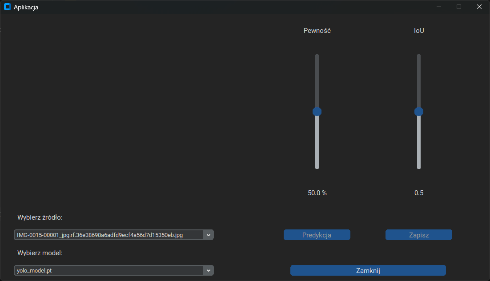
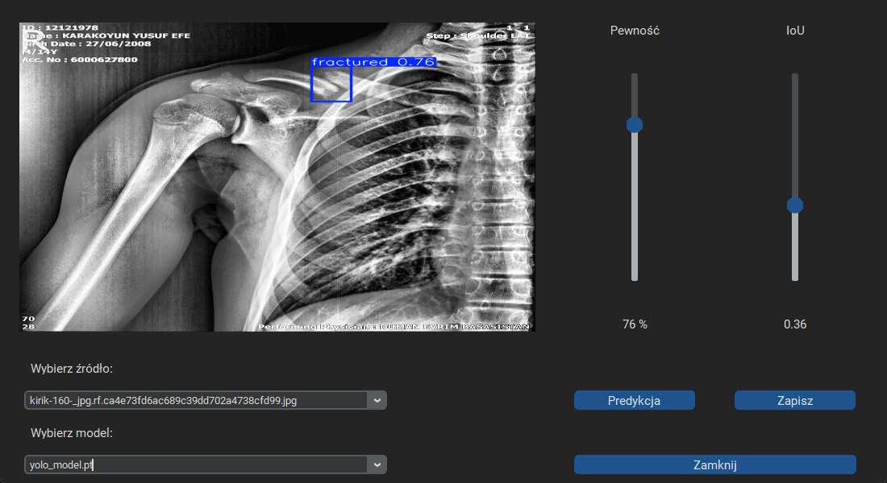

# YOLO Results GUI

A desktop application written in Python using **CustomTkinter**, enabling object prediction on images with **trained YOLO models (.pt)**.

The application allows you to select an image and a model, adjust prediction parameters (Confidence and IoU), and save the image with marked prediction bounding boxes.

---

## ✨ Features

- Support for trained YOLO models (`.pt`)
-  Selection of an image for prediction from a list
-  Image preview within the application
-  Adjustment of:
    - **Confidence** – percentage slider
    - **IoU (Intersection over Union)** – slider
-  Display of prediction bounding boxes with confidence values
-  Saving images with predictions to a folder
-  Modern GUI interface (CustomTkinter)

---

## 🗂️ Directory Structure (REQUIRED)

By default, the application requires a specific folder structure; however, you can change it in the `Ustawienia.py` file by specifying different paths for images, models, outputs, and labels.

The default structure is as follows:

```text
projekt/
│
├── aplikacja_pred.py
├── Ustawienia.py
├── Predykcja.py
│
├── Dane/
│   ├── zdjecia/     ← images (.jpg, .jpeg, .png)
│   ├── model/       ← YOLO models (.pt)
│   ├── Zapis/       ← saved predictions
│   └── label/       ← labels (optional)
```

## Step by step – how to run the application

1. **Download the repository** to your computer and make sure you have Python 3.9 or newer installed.

2. **Prepare directories and configure paths in the `Ustawienia.py` file**
   - By default, the application assumes a specific directory structure (folders for images, models, output results, and labels), but you can change it by specifying your own directories in `Ustawienia.py`.
   - Make sure the selected directories contain the appropriate files: images (`.jpg`, `.jpeg`, `.png`) and YOLO models (`.pt`).

3. **Install the required libraries** using the `requirements.txt` file:**

   ```bash
   pip install -r requirements.txt

4. **Run the application with the command:**
   ```bash
   python aplikacja_pred.py
<p float="left">
  

</p>

5. **Select an image and a model from the lists available in the GUI.**

6. **Adjust the prediction parameters using the Confidence and IoU sliders.**

7. **Start the prediction by clicking the Prediction button – the results will appear in the application window.**
<p float="left">
  
</p>

8. **Save the result to the output folder by clicking the Save button – the saved image will contain prediction bounding boxes and confidence values, and the file name will include the used model and selected parameters.**

## Requirements

The `requirements.txt` file contains all the necessary libraries to run the application.

This project is educational and can be easily extended with additional features, such as video support, camera input, or batch processing of multiple images simultaneously.

